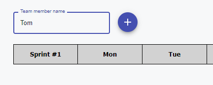
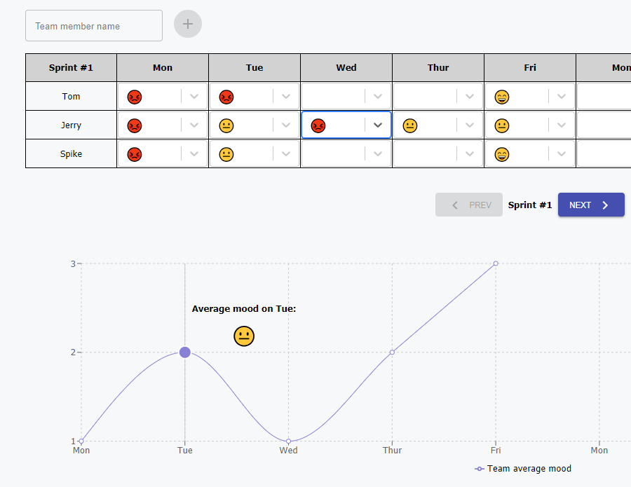
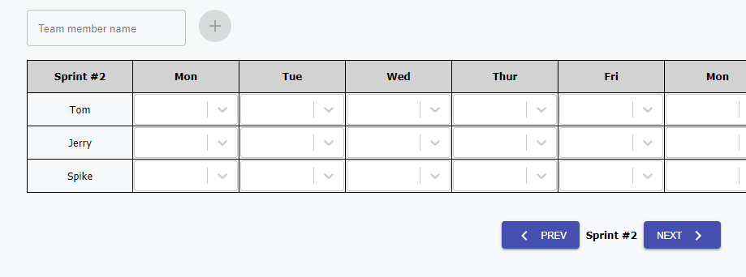

# Simple Niko-Niko calendar

## Instructions

Here are the instructions for running this application:

1. Pull updates from the repository
2. Run `npm install` in the root folder
3. Run `npm run build` for creating production build
4. Run `npm start` for running the application
5. You can see the result in your browser using [this link](http://localhost:5000)
6. For running tests, please use `npm test`

_P.S. If you want to change some variables (e.g. SPRINT_DURATION which can set the duration of sprints in **src\utils\constants.js**) just re-build it again and rerun (step 3 and 4 above) or just run development mode using `npm run start-dev`_

### What this application can do
* You can add a new one team member by using this button (please note, that it's available only for active sprint)

* After adding the team members you can fill the table according to their feedback. The LineChart will show the average team mood in real time

* By clicking **Next** button you can create a new sprint. Current team will be linked to the next sprint and the previous one will be marked as inactive (This means that you won't be able to add new members and their feedback to it)

* By clicking **Prev** button you can return back to the previous sprints and see stored information about your teammates
